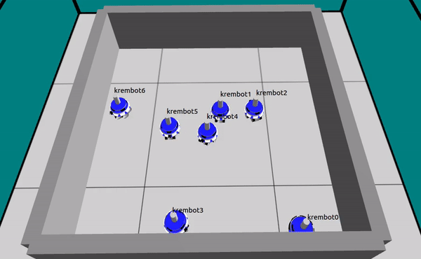

# Krembot Simulator
An Argos-Sim based simulator for Robotican's Krembot robot 



## Note:

* This simulation was tested and intended to work under Ubuntu 16.04.6 LTS

* Whenever `krembot_sim` directory mentioned in this README file, it referes to the root directory of this package.

## Installation

Run the installation script:

```
./krembot_sim/krembot/scripts/install.sh
```


## Sourcing setup_env.sh

This file contain argos enviorment variables, and should be sourced before using argos3.
If installation script finished successfuly, it also automatically source setup_env.sh file for the first time.
After that, whenever you open new terminal, you have to source the file again. This can be done by writing:

```
source ./krembot_sim/krembot/scripts/setup_env.sh
```

To avoid sourcing the file for every new terminal manually, you can add the source command to your .bashrc file.

## Directories Tree
There are 3 main directories in the package:
1. ***argos3*** - contain argos simualtion files
2. ***krembot*** - contain krembot library simulation files
3. ***argos3-user*** - this folder is for your use, and for most cases, it should be the only one you deal with during development

## Creating New Krembot Program

### Creating New Controller
1. Go into ```./krembot_sim/argos3-user/controllers```
2. Inside that directory, you will find ```program_template``` directory, that contains a template code files for krembot program. Those code files will be executed by the simulation the same way as ino file does on real krembot.
3. Create a copy of the ```program_template``` directory, and give it a name that describes your program.
4. Go inside the directory created in step 3, open CMakeList and change line 4 - replace "program_template" with the name you gave this directory in step 3. If your program contain more cpp files than just the ino, this is also the place to list them - go head and write those files under line 10. Save and close. 
5. Go into krembot.ino.cpp file. You can treat this as your .ino file. Add your code to this file. The places where you should put your code in are marked with "todo:" tags.
6. Go into the controllers directory again (step 1), open CMakeLists.txt inside that directory, and add your directory name to the list with ```add_subdirectory``` command. Save and close.

### Compiling the Controller
We are ready to compile your code, so go into ```./krembot_sim/argos3-user/build```, and write ```make``` in the termial

### Creating New Argos Configuration File
1. Cd into  ```./krembot_sim/argos3-user/config/```
2. Create a copy of the ```program_template.argos``` file, and give it the same name you gave your program inside your controllers CMakeFiles.txt
3. Replace ```program_template``` everywhere in the file with your program name from step 2
4. In line 53 provide full path to your controller .so file. This file can be found in ```argos3-user/build/your_program``` directory after building your code.
5. Further changes in this file can be made to configure simulation. The file is well-documented, so it should be relavily easy. More documentation can be found at https://www.argos-sim.info/documentation.php

### Running Your Controller
In order to run argos simulation, your should use ```argos3``` command along with ```-c``` flag and the path to your program .argos configuration file. Before you use this command, make sure you sourced the setup_env.sh file (see instructions above). 

```
argos3 -c path/to/your/argos/file.argos
```

In case you see an error telling you that ```libyour_program.so``` could'nt be found, make sure the path you provided to the .so file inside the configuration file is correct. If it is, then read the error carefully - sometimes code linking errors are hiding in this error message, and you might miss them at first glance.

### Editing Krembot Library Code
For some cases, you may want to edit the krembot library code. After editing the code, cd into krembot/build directory, and compile using

```
sudo make install
```

This will compile the code, and then install the updated header files under /usr/local/include/ , and the .so file under /usr/local/bin/

### Known Issues

#### Particle Library

Particle library contain lots of APIs. It's impossible (nor necessary) to support all of them as part of the scope of this project. Hence, this simulator supports only few basic features of it.

#### delay() function

delay shouldn't be used (on both real hardware and simulator) because during the delay time the robot can't keep sensing or acting on the inviorment. Instead, a timer should be used (each delay can be easily replaced by a timer). Further more, implementation of such function in Argos simulation will cause more issues like frozen GUI, and eventually unresponsive application. Therefore delay() function is not supported by the simulator. Instead, a timer library called "Sand Timer" is provided, and can be used in the same way it is used in real Krembot.

#### Particle.publish()

***tl;dr***
```Particle.publish()``` API is only accessible from krembot.ino.cpp file.

In real Photon chip, a single instance of Particle object is created, which contains information about the Photon chip. Each robot have its own memory space, which isn't shared with other robots. Argos achieves similar results by creating and running controller instances. Particle's API to publish message is ```Particle.publish```, this means that we have to create a global Particle object in order to allow all client's code to call this API. Doing this will cause all controller's (and in turn Krembot) instances to use the same Particle object, which is incorrect since Particle have to hold internal data about a specific krembot instance (such as ID). 

However, it's possible to create Particle object as part of the controller, such that for each instance a new Particle instance will be created with a specific krembot data. This implemetation solves the problem, but also means the user is limited to use this API only inside krembot.ino.cpp file.

### Sensors Behavior 

Some sensors behave diffrently than normal, in order to immitate real hardware sensors, which also work that way. (This is not a simulation limitation, but a requirement)

#### Proximity (IR) Sensor 

Normally, this sensor should measure the distance to the closest object in front of it. Real Krembot hardware return maximum distance when another krembot is in front of the sensor, and distance from object when something other than krembot is in front. The same behavior is implemented in the simulator. 

#### Bumpers 

Normally, this sensor should return "true" whenever the bumper is close enough to an object. Real Krembot hardware bumper is only pressed when it is pressed with a certain amount of force. The same behavior is implemented in the simulator. 

## Further Documentation
https://www.argos-sim.info/documentation.php

https://github.com/ilpincy/argos3

https://github.com/ilpincy/argos3-examples


