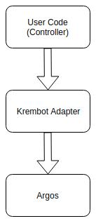

This file was written for future contributors. It assumes that before reading this file you read all the other resources mentioned in the [README.md](README.md) file.

## Architecture
The Krembot simulation is mostly based on the Argos simulator. This is why it's highly recommended that you learn all there is to know about Argos before getting into contributing to this simulator (refer to [README.md](README.md) for resources).
ARGoS was chosen to use as a foundation for Krembot simulator as it is a multi-physics robot simulator. It can simulate large-scale swarms of robots of any kind efficiently. You can customize ARGoS by adding new plug-ins. 

One of the requirements for Krembot simulator is to use the exact same API as the real Krembot library. Argos expose its own interface to control the robots, so writing an adapter for Krembot APIs was necessary. The adapter expose Krembot API to the user, and converts it to an Argos interface "behind the scenes":



In addition, Argos provides a simulated robot called "footbot" out of the box. This robot looks similar to "Krembot", so it is used to simulate the Krembot. This required some changes in the position of the footbot sensors to match those of the Krembot:

- The Argos code base is under ```./krembot_sim/argos3/```. The original repository can be found [here](https://github.com/ilpincy/argos3)
- The krembot adapter is under ```./krembot_sim/krembot/```.
- The user folder is under ```./krembot_sim/krembot_ws/```. This folder is based on the original [Argos examples repository](https://github.com/ilpincy/argos3-examples). The directory content and name was changed to simplify things, and to make it obvious that in most cases this is the only folder the user should deal with.

## Changes in Argos
Some of the Krembot abilities were natively supported by Argos, but some are not. This required changes in Argos code base to make it suitable for our needs. Here is a list of some of the main changes done inside the Argos code base (you can see the detailed changes in git commits history):

- Added IMU sensor plugin
- Changed proximity sensor behavior
- Exposing some sensors private API for Krembot adapter use
- Changed footbot model sensors position to match Krembot sensors
- Added light sensor the ability to detect Krembot LED (and not only simulator pre-defined light sources)

## Supporting New Krembot APIs
Most of the support can be done in the Krembot adapter, as long as Argos supports it. For example: if you need to support an encode sensor, you can expose Krembot APIs in the adapter, and call Argos encoder. But if Argos doesn't support encoder sensor, you'll have to write it yourself first.

## Fixing bugs
Some bugs are [known](known_issues.md) and can't be fixed (easily) because of simulator limitations or requirements. In general bugs can originate in user controller, Krembot adapter or Argos code. In order to isolate it, it is recommended to debug the controller, then the adapter, and only then the simulator.

### Editing Krembot Library Code
For some cases, you may want to edit the krembot library code. After editing the code, cd into krembot/build directory, and compile using

```
sudo make install
```

This will compile the code, and then install the updated header files under /usr/local/include/ , and the .so file under /usr/local/bin/

